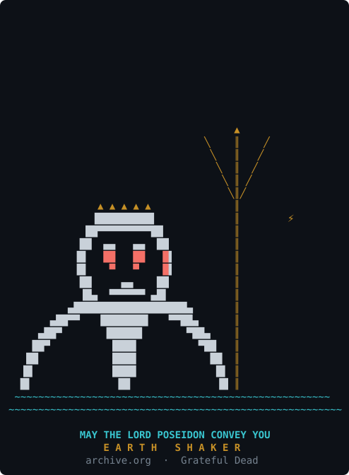
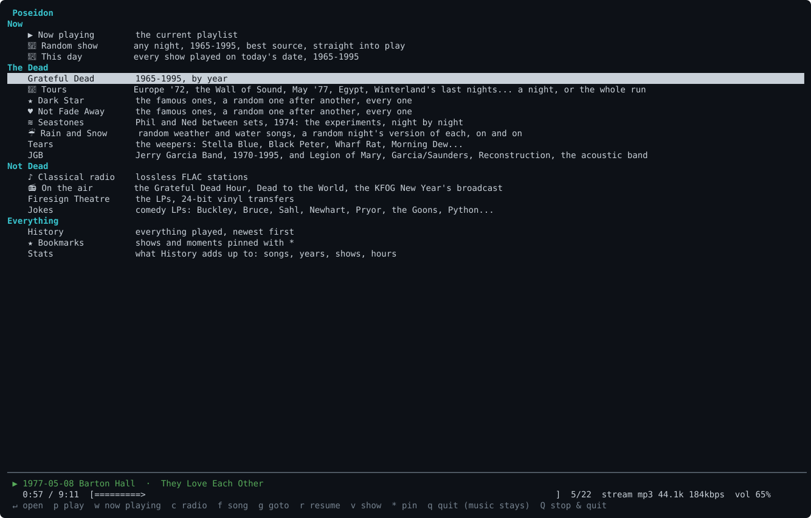
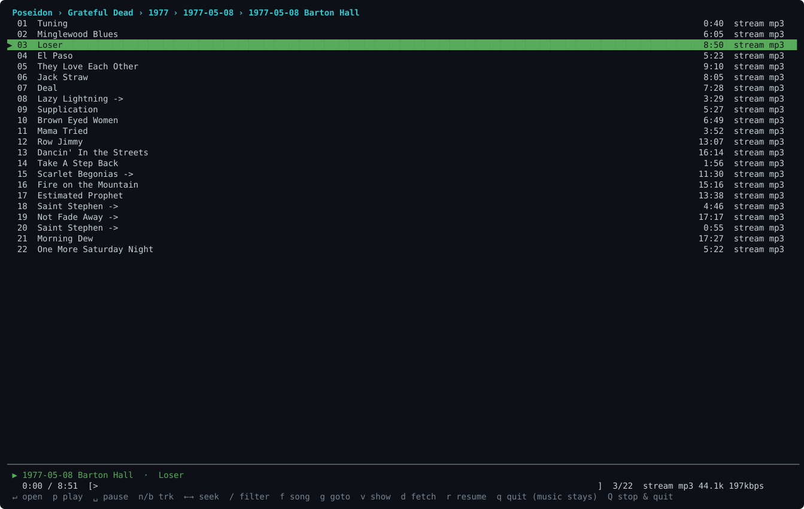
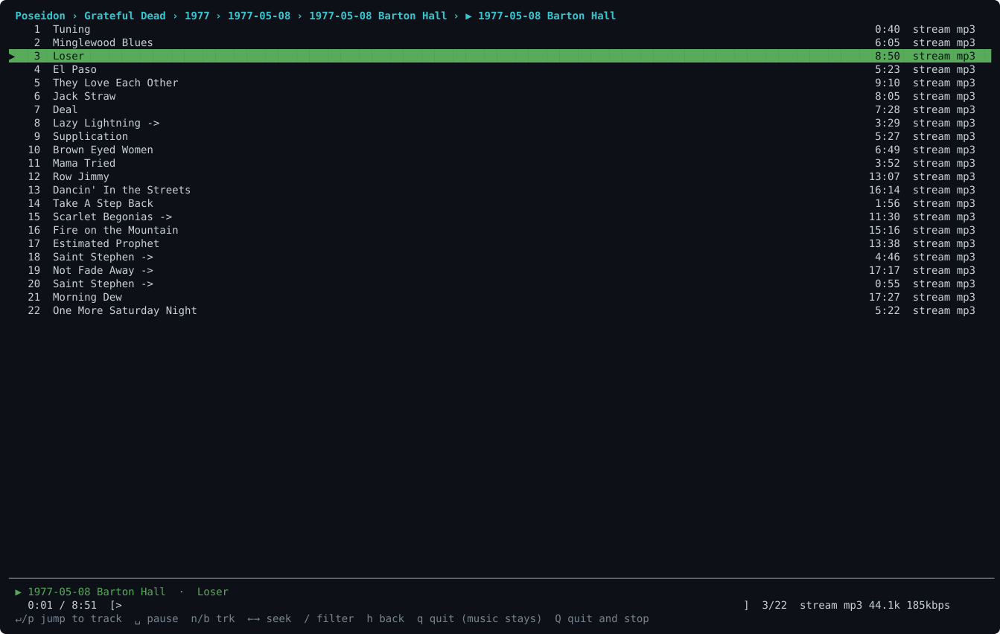
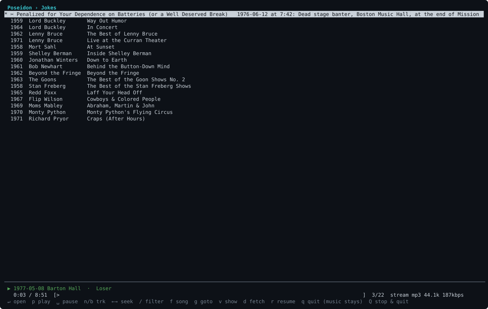
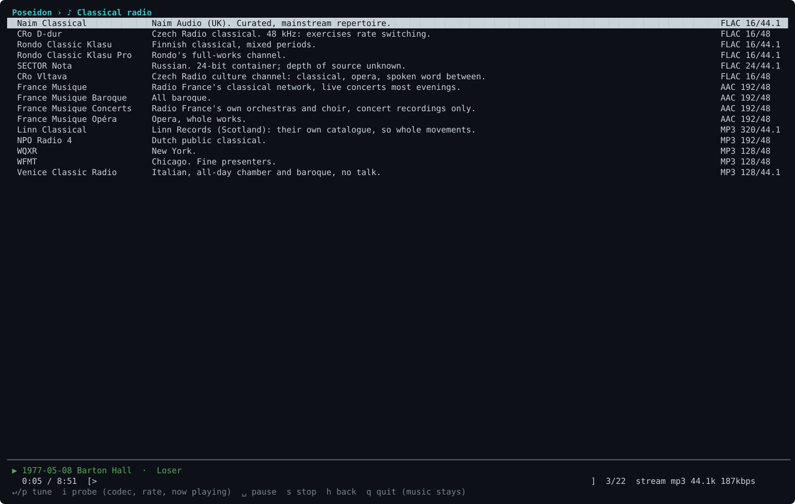
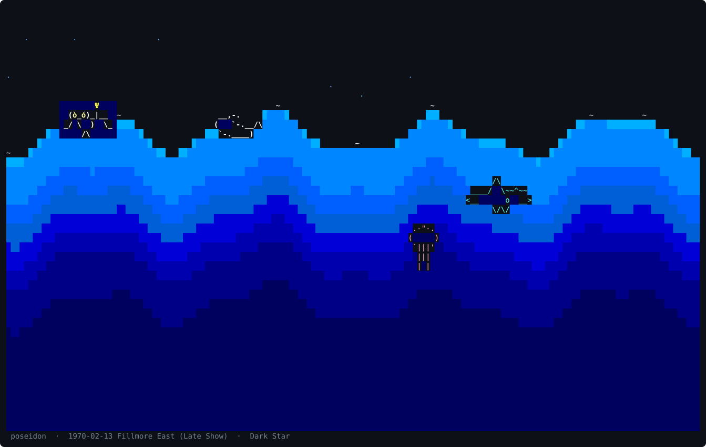

# May The Lord Poseidon Convey You

A terminal player for the archive.org Grateful Dead collection, and the audio
plumbing around it. Stock Python 3 (curses), mpv, PipeWire. No pip: run the scripts
from a clone, or download one self-contained build from Releases.

```
scripts/poseidon.py                           # one door to every tool: bare = the TUI,
                                              # poseidon gdarchive|deadviz|radio|restore-playlist ..., poseidon doctor
scripts/May-The_Lord_Poseidon-Convey-You.py   # the TUI (scripts/deadtui.py is a symlink)
scripts/gdarchive.py                          # search and download shows, tag them, shn -> flac
scripts/deadviz.py                            # the light show: 15 modes, one of them is Poseidon
scripts/radio.py                              # lossless classical radio stations
scripts/restore-playlist.py                   # snapshot / restore the mpv playlist
```

The TUI browses years, dates, sources and tracks; plays local FLAC when a show
has been fetched and streams otherwise; has JGB, Firesign Theatre, Jokes,
Tears, Rain and Snow, Random show, a memory set list, History and Now Playing;
adopts an mpv it finds already running (q keeps the music, Q stops it); and
starts with Poseidon, trident raised.

## Screenshots

The splash, two seconds of the Earth Shaker:



The home screen, and a show:




Now Playing (w), the Jokes menu, the radio list:





The light show's Poseidon mode (v, then V): the bass raises the swell, a beat shakes the
earth, and the cast drops by.



Screenshots are SVGs made from `tmux capture-pane -e` by `scripts/ansi2svg.py`.

## Running it

**Download.** Each [release](https://github.com/originalrexconsulting/may-the-lord-poseidon-convey-you/releases)
has one self-contained file per machine, Python and the light show's numpy included.
The machine needs only mpv (`apt install mpv`, `brew install mpv`); ffmpeg is optional
(SHN tapes to FLAC, the station probe) and on Linux `pulseaudio-utils` gives the light
show its audio tap.

| Machine | File |
|---|---|
| Linux x86_64, and Windows under WSL 2 | `poseidon-<ver>-linux-x86_64` |
| Linux aarch64 (Raspberry Pi 4/5 and up, Graviton) | `poseidon-<ver>-linux-aarch64` |
| Mac, Apple silicon | `poseidon-<ver>-macos-aarch64` |
| Mac, Intel | `poseidon-<ver>-macos-x86_64` |

```
curl -fLo poseidon https://github.com/originalrexconsulting/may-the-lord-poseidon-convey-you/releases/download/v<ver>/poseidon-<ver>-linux-x86_64
chmod +x poseidon
./poseidon doctor        # what this build is and what it found: mpv, ffmpeg, library, terminfo
./poseidon               # the TUI; ./poseidon gdarchive ..., ./poseidon radio list, ./poseidon --help
```

`<ver>` is the release date, e.g. `2026.09.13`; copy the link from the release page.
The first run unpacks its Python into `~/.cache/nce` (macOS: `~/Library/Caches/nce`),
which takes a few seconds once and is safe to delete. `poseidon-<ver>.pex` is the same
program for a machine that already has Python 3.11+ on PATH: it uses the system's numpy
(`python3-numpy`) for the light show and is a tenth the size.

Shows fetched with `d` land in `~/Music/dead`; `POSEIDON_LIBRARY=/path/to/dead` moves
the library. From a clone the library is `dead/` next to `scripts/`.

**Or clone.** Per-OS guides: [Linux](docs/setup-linux.md), [macOS](docs/setup-macos.md),
[Windows](docs/setup-windows.md) (WSL 2). The short version:

Linux (Debian): `apt install mpv python3-numpy python3-mutagen pulseaudio-utils ffmpeg`
(numpy is the light show, mutagen tags fetched shows, parec is the light show's audio
tap, ffmpeg converts SHN tapes). Then `scripts/May-The_Lord_Poseidon-Convey-You.py`.

macOS: `brew install mpv ffmpeg python numpy` and `pip3 install mutagen` (both optional:
without numpy there is no light show, without mutagen fetched shows are left untagged).
Playback goes straight to CoreAudio, so pick the DAC in Sound settings. The light show
needs an audio tap, which macOS does not provide by itself: `brew install blackhole-2ch`,
make a Multi-Output Device in Audio MIDI Setup with the DAC and BlackHole, set it as
output, and the tap reads BlackHole back through ffmpeg (`DEADVIZ_DEVICE` names it if
yours is not "BlackHole 2ch"). The status line's DAC rate readout is Linux-only and
stays blank. `radio.py`'s own commands (`play`, `now`) drive Strawberry over D-Bus and
are Linux-only; the station list itself is used by the TUI everywhere.

Windows: run it under WSL 2 as Linux, with the linux-x86_64 download or the Debian
recipe above. Native Windows would need `windows-curses` and a named pipe for mpv; not
done.

`SYSTEM.md` is the reference: the setup, every key, every script, and the
facts about archive.org that shape what you get (soundboards stream only,
audience tapes download lossless). `AUDIO-ANSIBLE.md` is the spec for the
PipeWire side.

## Endorsement

Enik the Altrusian has examined this project from the fifth dimension, by way of the
pylon's crystal matrix, and has approved it. He notes that the Sleestak, being
cold-blooded and slow, prefer the light show's `life` mode; that the time doorway will
not open until 5/8/77 has finished playing; and that the Marshalls, who fell through a
similar doorway on a routine expedition, could have used the `r` key. Do not touch the
crystals in the wrong order.

MIT license.
