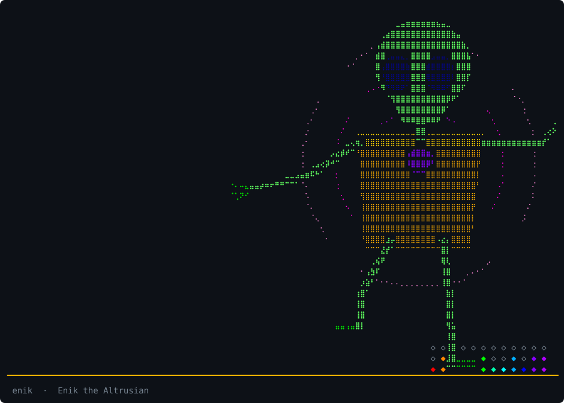
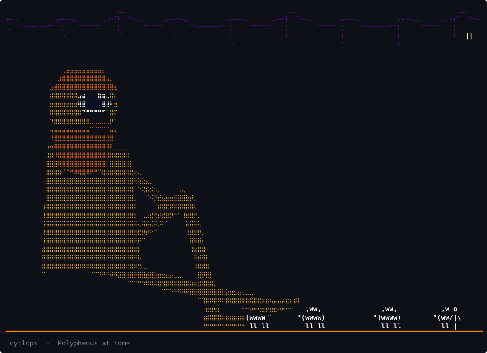
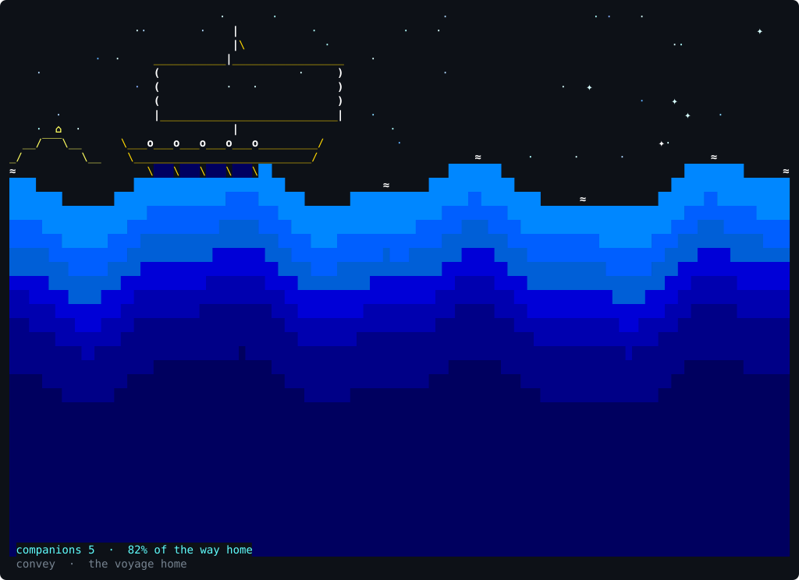
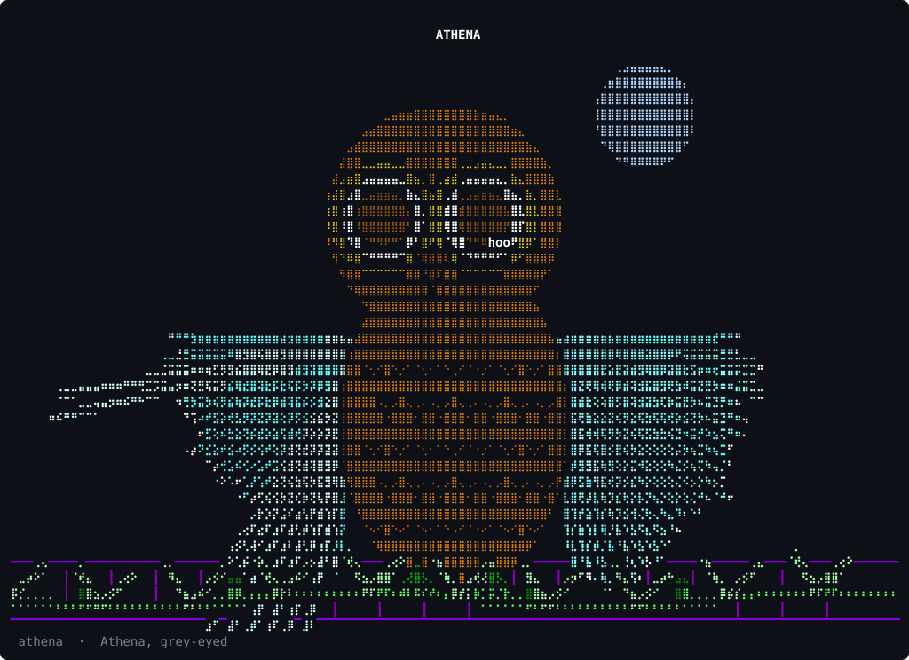

# May The Lord Poseidon Convey You

A terminal player for the archive.org Grateful Dead collection, and the audio
plumbing around it. Stock Python 3 (curses), mpv, PipeWire. No pip: run the scripts
from a clone, or download one self-contained build from Releases.

```
scripts/poseidon.py                           # one door to every tool: bare = the TUI,
                                              # poseidon gdarchive|deadviz|radio|restore-playlist ..., poseidon doctor
scripts/May-The_Lord_Poseidon-Convey-You.py   # the TUI (scripts/deadtui.py is a symlink)
scripts/gdarchive.py                          # search and download shows, tag them, shn -> flac
scripts/deadviz.py                            # the light show: 24 modes; Poseidon, Enik, Polyphemus, the voyage home, Athena's owl, Althea,
                                              # the strait of Scylla, the Sleestak, the Stealie, the Wall of Sound
scripts/radio.py                              # lossless classical radio stations
scripts/restore-playlist.py                   # snapshot / restore the mpv playlist
```

The TUI browses years, dates, sources and tracks; plays local FLAC when a show
has been fetched and streams otherwise; has JGB (Jerry's own bands, 1970-1995), Firesign
Theatre, Jokes, Tears, Dark Star, Not Fade Away, Seastones (Phil and Ned's 1974 experiments),
Rain and Snow, Random show, History and Now Playing;
adopts an mpv it finds already running (q keeps the music, Q stops it); and
starts with Poseidon, trident raised.

## Screenshots

The splash, two seconds of the Earth Shaker:


The home screen, and a show:


Now Playing (w), the Jokes menu, the radio list:


In the light show, `v` cycles the modes forward and `V` backward, so from the first
mode `V` walks through the newest ones: the Wall of Sound, the Stealie, the Sleestak, the strait,
Althea, Athena's owl, the voyage, Polyphemus, Enik, Poseidon.

The Poseidon mode: the bass raises the swell, a beat shakes the earth, and the cast
drops by.


Enik the Altrusian, head to foot and moving the way the costume did:
the bass opens the time doorway behind him, the crystal matrix lights one crystal per
band, and a beat flashes his eyes.



Polyphemus at home: Poseidon's son, and the reason the Lord Poseidon conveys nobody. He breathes with the bass, his eye follows the loudest band, and on a
big beat he picks a man out of the flock. Leave the music off long enough and Nobody
comes for him.



May the Lord Poseidon convey you: the voyage Polyphemus promised. The black ship rows
west toward Ithaca, faster the louder the music. On a big beat the Earth Shaker rises
ahead of it and conveys it his way, a wave that throws it back and takes a companion.
Lose them all and Odysseus is alone on a raft. Reach Ithaca and the Cyclops sees him
off again, boulder and all.



Athena, grey-eyed, as her owl on an olive branch under the moon over the Parthenon. The
wings are the spectrum, one feather per band, fanning open as the music gets loud and
snapping wide on a beat; the grey eyes give light with the music, brightest on a beat, the
moon their catchlight; they dilate with the bass and follow the stereo balance; the
head snaps toward the loudest band the way an owl's does. The body dances: a sway on the
beat from foot to foot, the far wing lifting against the lean like a dancer's arm, a dip
and a spring back taller, the head held steady above it.
Quiet music, and it asks the
only question an owl asks. The answer here is Nobody.



Althea is not Athena. Athena is the grey-eyed goddess of wisdom, the owl above. Althea
is the healer: the name is the Greek Althaea, from *althainein*, to heal, and the
marshmallow, Althaea officinalis, is the old healing herb, hollyhock's cousin. In the
myth she is queen of Calydon and Meleager's mother, who took the half-burnt brand off
the fire when the Fates said her son would live only as long as it did, and kept it in
a chest for years. Hunter's Althea is the first kind, the one who tells you to cool
down, settle back, easy Jim. So the mode has her at the hearth in Calydon with the
brand. The fire is the spectrum, one flame per band; the log's ember glows with the
bass, sparks fly on a beat, smoke thickens with the mids, and hollyhocks bloom either
side on the treble. She dances seated, hair a beat behind her shoulders, one hand
keeping time on her knee. Music too hot for too long and she draws the brand out and
raises a palm; when it settles she puts it back. Silence, and she stirs the embers.

The strait is the next chapter of the voyage. Scylla's rock on the left, her cave in it and
six necks swaying out of it over the water; Charybdis on the right, a whirlpool that dips
the sea and spins faster and wider with the bass. The ship rows west between them. Near the
maw the bass drags on the oars and spins the ship, and if it stays high she drinks it down
and spits it back, one companion fewer. In reach of the rock a big beat sends a head down
to the deck and Scylla takes one. Through the strait, it starts again from the east.

The Sleestak have the Lost City to themselves: the pylon's crystals lit by the bass, the
Marshalls' torch in the middle with a flame that is the bass. They come out of the dark on
either side, but they are cold-blooded and slow: they only step when the music is warm,
they stop dead when it goes quiet, and the torch's light keeps them back. A beat flashes
their eyes and they hiss.

The Stealie: the skull in the ring, the thirteen points around it one group of bands each,
turning faster with the music, the bolt flashing white on a beat. The red half warms with
the bass, the blue with the treble, and the eye sockets widen with the bass.

The Wall of Sound, 1974, as the PA it was: stacks of cabinets, one per instrument where
they stood, Bob, Phil's quad bass (four columns, one per string), the vocal cluster in the
middle and tallest, Jerry, Keith, the drums. Each stack lights from the bottom with its own
bands, the peak cabinet holds, and a beat shakes the scaffold.

Screenshots are SVGs made from `tmux capture-pane -e` by `scripts/ansi2svg.py`. The four
newest modes have none yet.

## Running it

**Download.** Each [release](https://github.com/originalrexconsulting/may-the-lord-poseidon-convey-you/releases)
has one self-contained file per machine, Python and the light show's numpy included.
The machine needs only mpv (`apt install mpv`, `brew install mpv`); ffmpeg is optional
(SHN tapes to FLAC, the station probe) and on Linux `pulseaudio-utils` gives the light
show its audio tap.

| Machine | File |
|---|---|
| Linux x86_64, and Windows under WSL 2 | `poseidon-<ver>-linux-x86_64` |
| Linux aarch64 (Raspberry Pi 4/5 and up, Graviton) | `poseidon-<ver>-linux-aarch64` |
| Mac, Apple silicon | `poseidon-<ver>-macos-aarch64` |
| Mac, Intel | `poseidon-<ver>-macos-x86_64` |

```
curl -fLo poseidon https://github.com/originalrexconsulting/may-the-lord-poseidon-convey-you/releases/download/v<ver>/poseidon-<ver>-linux-x86_64
chmod +x poseidon
./poseidon doctor        # what this build is and what it found: mpv, ffmpeg, library, terminfo
./poseidon               # the TUI; ./poseidon gdarchive ..., ./poseidon radio list, ./poseidon --help
```

`<ver>` is the release date, e.g. `2026.09.13.2`; copy the link from the release page.
The first run unpacks its Python into `~/.cache/nce` (macOS: `~/Library/Caches/nce`),
which takes a few seconds once and is safe to delete. `poseidon-<ver>.pex` is the same
program for a machine that already has Python 3.11+ on PATH: it uses the system's numpy
(`python3-numpy`) for the light show and is a tenth the size.

Shows fetched with `d` land in `~/Music/dead`; `POSEIDON_LIBRARY=/path/to/dead` moves
the library. From a clone the library is `dead/` next to `scripts/`.

**Or clone.** Per-OS guides: [Linux](docs/setup-linux.md), [macOS](docs/setup-macos.md),
[Windows](docs/setup-windows.md) (WSL 2). The short version:

Linux (Debian): `apt install mpv python3-numpy python3-mutagen pulseaudio-utils ffmpeg`
(numpy is the light show, mutagen tags fetched shows, parec is the light show's audio
tap, ffmpeg converts SHN tapes). Then `scripts/May-The_Lord_Poseidon-Convey-You.py`.

macOS: `brew install mpv ffmpeg python numpy` and `pip3 install mutagen` (both optional:
without numpy there is no light show, without mutagen fetched shows are left untagged).
Playback goes straight to CoreAudio, so pick the DAC in Sound settings. The light show
needs an audio tap, which macOS does not provide by itself: `brew install blackhole-2ch`,
make a Multi-Output Device in Audio MIDI Setup with the DAC and BlackHole, set it as
output, and the tap reads BlackHole back through ffmpeg (`DEADVIZ_DEVICE` names it if
yours is not "BlackHole 2ch"). The status line's DAC rate readout is Linux-only and
stays blank. `radio.py`'s own commands (`play`, `now`) drive Strawberry over D-Bus and
are Linux-only; the station list itself is used by the TUI everywhere.

Windows: run it under WSL 2 as Linux, with the linux-x86_64 download or the Debian
recipe above. Native Windows would need `windows-curses` and a named pipe for mpv; not
done.

`SYSTEM.md` is the reference: the setup, every key, every script, and the
facts about archive.org that shape what you get (soundboards stream only,
audience tapes download lossless). `AUDIO-ANSIBLE.md` is the spec for the
PipeWire side.

## Endorsement

Enik the Altrusian has examined this project from the fifth dimension, by way of the
pylon's crystal matrix, and has approved it. He notes that the Sleestak, being
cold-blooded and slow, prefer the light show's `life` mode; that the time doorway will
not open until 5/8/77 has finished playing; and that the Marshalls, who fell through a
similar doorway on a routine expedition, could have used the `r` key. Do not touch the
crystals in the wrong order.

MIT license.
